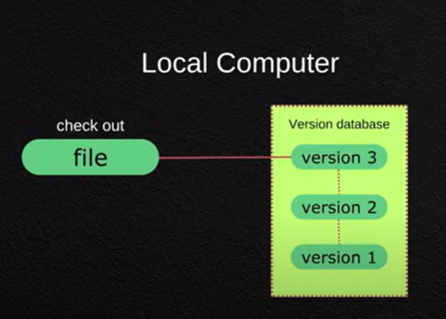
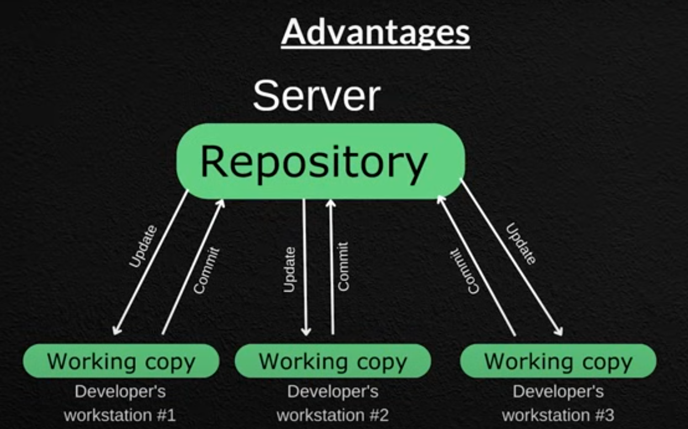
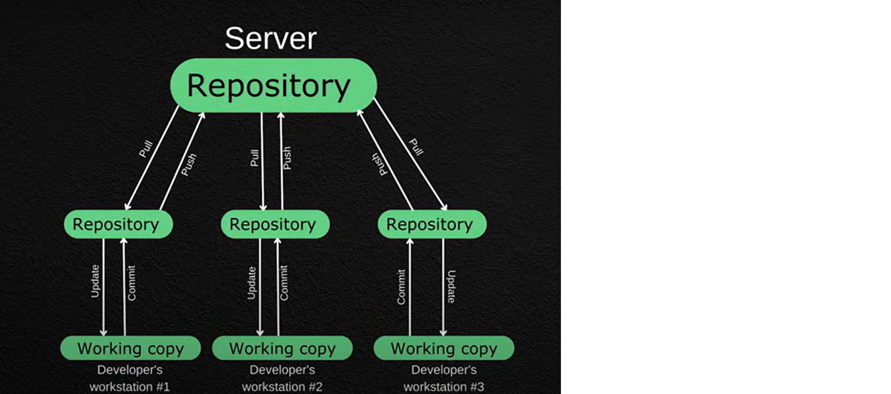
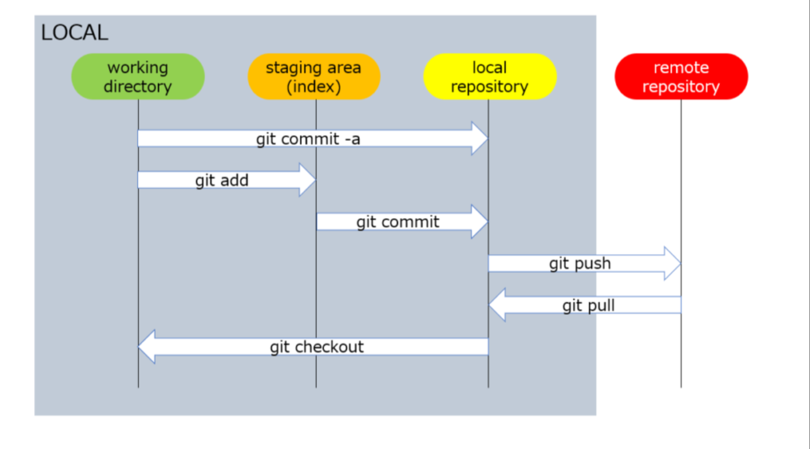
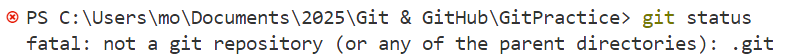
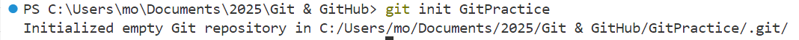
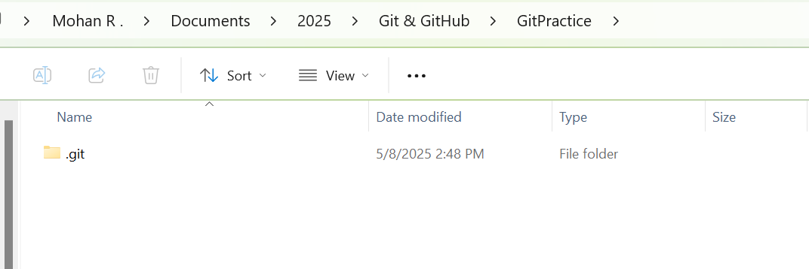

### **1. What is Git?**
Git is a **distributed version control system** designed to track changes in source code during software development. It allows multiple developers to work on a project simultaneously without interfering with each other's work.

### **2. Different Types of Version Control Systems**
Version control systems (VCS) are tools that help manage changes to source code over time. There are three main types:

#### **A local version control system**
- **LVCS** is a type of version control system where all the versioning information is stored on the local machine. This means that the entire history of changes and versions is kept on the developer's computer, without any need for a central server.  


#### **Centralized Version Control Systems (CVCS)**
- **CVCS** use a central server to store all versions of a project. Developers check out files from the central repository, make changes, and commit them back to the server.  


#### **Distributed Version Control Systems (DVCS)**
- **DVCS** allow each developer to have a local copy of the entire repository. Changes can be made locally and later synchronized with other repositories.  


### **3. What is an Open Source Project?**
An open source project is a project whose source code is made freely available for anyone to use, modify, and distribute. Open source projects encourage collaborative development and transparency. Examples of open source software include Linux, Apache, and Mozilla Firefox.

### **4. Brief History of Git**
Git was developed by Linus Torvalds in 2005 after the free license for BitKeeper, a proprietary version control system used for Linux kernel development, was revoked [1](https://en.wikipedia.org/wiki/Git). Torvalds needed a system that was fast, supported non-linear development, and was capable of handling large projects efficiently [4](https://git-scm.com/book/en/v2/Getting-Started-A-Short-History-of-Git). Since its creation, Git has become the most widely used version control system in the world [1](https://en.wikipedia.org/wiki/Git).


### **5. Git Setup**
1. **Download Git**:
   - Go to the Git website and download the appropriate version for your operating system.

2. **Install Git**:
   - Run the downloaded installer and follow the installation instructions. You can keep the default settings unless you have specific preferences.

3. **Configure Git**:
   - Open a terminal or command prompt and set your username and email. These details will be associated with your commits.
     ```sh
     git config --global user.name "Your Name"
     git config --global user.email "your.email@example.com"
     ```

4. **Verify the Installation**:
   - To ensure Git is installed correctly, you can check the version:
     ```sh
     git --version
     ```
### **5. Git Configuration**
#### **Local Configuration**
Local configuration applies to a specific repository. Settings configured at this level only affect the repository where they are set.

**Example**:
1. Navigate to your repository:
   ```sh
   cd path/to/your/repository
   ```
2. Set a local configuration:
   ```sh
   git config user.name "Local User"
   git config user.email "local.email@example.com"
   ```
3. View the local configuration:
   ```sh
   git config --local --list
   ```

#### **Global Configuration**
Global configuration applies to all repositories for the current user. Settings configured at this level affect all repositories the user works with on the machine.

**Example**:
1. Set a global configuration:
   ```sh
   git config --global user.name "Global User"
   git config --global user.email "global.email@example.com"
   ```
2. View the global configuration:
   ```sh
   git config --global --list
   ```

#### **System Configuration**
System configuration applies to all users and repositories on the machine. Settings configured at this level affect every repository and user on the system.

**Example**:
1. Set a system configuration (requires administrative privileges):
   ```sh
   sudo git config --system user.name "System User"
   sudo git config --system user.email "system.email@example.com"
   ```
2. View the system configuration:
   ```sh
   git config --system --list
   ```

#### **Priority Order**
Git uses the following priority order for configurations:
1. **Local** settings override **global** settings.
2. **Global** settings override **system** settings.

This means if you have the same setting configured at multiple levels, the local setting will take precedence over the global and system settings.

#### **Example Scenario**
Imagine you have the following configurations:

- **System**:
  ```sh
  sudo git config --system user.name "System User"
  sudo git config --system user.email "system.email@example.com"
  ```

- **Global**:
  ```sh
  git config --global user.name "Global User"
  git config --global user.email "global.email@example.com"
  ```

- **Local** (in a specific repository):
  ```sh
  cd path/to/your/repository
  git config user.name "Local User"
  git config user.email "local.email@example.com"
  ```

When you make a commit in the specific repository, Git will use the local configuration (`Local User` and `local.email@example.com`). If you make a commit in another repository without local settings, Git will use the global configuration (`Global User` and `global.email@example.com`). If no global settings are found, Git will fall back to the system configuration (`System User` and `system.email@example.com`).

### **Working Directory, Staging Area and Repository**


**1. Working Directory (or Working Tree)**  
The Working Directory is the directory on your local machine where your project files are located. This is where you make changes to your code — edit, add, or delete files. Think of it as the workspace where you develop your project.

- **Files in this stage**: When you open your project and start modifying files, those changes are reflected in the working directory.
- **Status**: Files here can either be tracked or untracked.
- **Tracked files** are files that Git knows about. These include files that have been committed before.
- **Untracked files** are new files that Git doesn’t know about yet because they haven’t been added to the repository.
  
**Example:**
- Imagine you’re writing code for a web app. The folder where you have all your HTML, CSS, and JavaScript files is your working directory. When you edit the index.html file or create a new script.js file, you're working in this directory.

**2. Staging Area (or Index)**

The Staging Area is like a preparation zone where you decide what changes you want to include in the next commit. It’s an intermediate space between the working directory and the repository.

- **Purpose**: It allows you to select specific changes to be committed while leaving other changes untracked or for later commits. This lets you break up your work into logical commits even if multiple changes are made at once.
- **How it work**s: When you are satisfied with the changes you’ve made, you use the git add command to move those changes from the working directory into the staging area. Files in the staging area are marked for inclusion in the next commit.

**Example**:  
- Let’s say you’ve updated the index.html file and added a new styles.css file. You might decide to add the changes in index.html to the next commit while leaving styles.css for a later commit. You would use git add index.html to stage only the changes in the index.html file.
   ```
   # Add specific file to staging
   git add index.html
   ```
- Now, the changes in index.html are staged and ready for the next commit, but the styles.css file remains untracked in the working directory.

**3. Repository (or Local Repository)**  
The Repository is the place where your committed changes are stored. It can be thought of as the “official” history of your project. Every commit you make is recorded here, forming a timeline of your project’s evolution. The repository consists of all the commits and branches for the project.

- **Purpose**: The repository stores the history of your project, allowing you to track changes over time, revert to earlier versions, and collaborate with others.
- **How it works**: After staging your changes in the staging area, you create a commit using the git commit command. This commit permanently saves the changes in the local repository. Once committed, the files are part of the project’s official history.

**Example**:
- When you are happy with the changes you’ve staged, you run git commit -m "Updated index.html file". This takes the changes from the staging area and commits them to the local repository.
   ```
   # Commit staged changes with a message
   git commit -m "Updated index.html with new sections"
   ```
- This commit is now part of the repository’s history, and the changes in index.html are officially recorded.

## **Git Commands**

### **1. git status**
```
git status
```
The `git status` command is used to display the state of the working directory and the staging area. It shows which changes have been staged, which haven't, and which files aren't being tracked by Git. Here's a breakdown of what `git status` provides:

#### **Output of `git status`**
- **Untracked files**: Files in your working directory that aren't being tracked by Git.
- **Changes not staged for commit**: Modifications in your working directory that haven't been added to the staging area.
- **Changes to be committed**: Changes that have been added to the staging area and are ready to be committed.

**Note**: If we check the status of git without local repository created git will throw an error.  


### **2. git init**
The `git init` command is used to create a new Git repository. It initializes a new, empty repository in the specified directory. If no directory is specified, it initializes the repository in the current directory.

```bash
git init [directory]
```

#### **Example**
```bash
git init my_project
```

#### **What Happens When You Run `git init`**
- **Creates a `.git` directory**: This directory contains all the necessary metadata and object files for the repository.


- **Sets up the repository**: Prepares the directory for tracking changes to files.

### **3. git add**
- The `git add` command is used to add changes in the working directory to the staging area. This prepares the changes to be committed to the repository. Here's how you can use it:
   ```bash
   git add <file>
   ```

- Replace `<file>` with the name of the file you want to add. If you want to add all changes, you can use:
   ```bash
   git add .
   ```
- This command stages all changes in the current directory.
- The git rm --cached <file> command is used to remove a file from the staging area without deleting it from your working directory. Essentially, it unstages the file and keeps it in your local directory. Here's how it works:
   ```
   git rm --cached <file>
   ```

### **4. git commit**
The `git commit` command is used to save your changes to the local repository. When you commit, you are creating a snapshot of the changes in the staging area. Here's the basic syntax:

```bash
git commit -m "Your commit message"
```

Replace `"Your commit message"` with a brief description of the changes you made. This message helps you and others understand what changes were made in this commit.

If you want to commit all staged changes without specifying a message in the command line, you can use:

```bash
git commit
```

This will open your default text editor to write the commit message.

### **5. git log**
The git log command is used to display the commit history of the repository. It shows a list of all the commits made, along with details such as the commit hash, author, date, and commit message. Here's how you can use it:
```
git log
```

It looks like you're asking about **"git stage skip"**, but there is no official Git command called `git stage skip`. However, based on your query, you might be referring to **ways to skip the staging area** when committing changes. Here's a breakdown of what that means and how to do it:

---

### **6. Skipping the Staging Area in Git**

Normally, Git uses a **staging area** (also called the index) where you prepare changes before committing. But sometimes, you might want to **skip staging** and commit directly.

**Use `git commit -a`**
```bash
git commit -a -m "Your commit message"
```
- Automatically stages **all modified and deleted** files that are already tracked.
- **Does not include** new (untracked) files.

### **7. git diff**
The git diff command shows the differences between commits, branches, files, and the working directory. It helps you understand what changes have been made before committing or staging.

| **Use Case**                                      | **Command**                                | **Description**                                                                 |
|--------------------------------------------------|--------------------------------------------|---------------------------------------------------------------------------------|
| View unstaged changes                            | `git diff`                                 | Shows changes in the working directory that are not yet staged.                |
| View staged changes                              | `git diff --cached` or `git diff --staged` | Shows changes that have been staged (added) but not yet committed.             |
| Compare working directory with last commit       | `git diff HEAD`                            | Shows all changes (staged + unstaged) since the last commit.                   |
| Compare two commits                              | `git diff <commit1> <commit2>`             | Shows differences between two specific commits.                                |
| Compare two branches                             | `git diff branch1..branch2`                | Shows what is in `branch2` but not in `branch1`.                               |
| Compare specific file                            | `git diff <filename>`                      | Shows changes in a specific file.
                                             |                          |

### **8. git rm – Remove Files from Git**
The git rm command is used to remove files from the working directory and the staging area (index), so they are deleted in the next commit.
Here are notes on the concept of **removing files in Git**, typically done using the `git rm` command:

**Basic Syntax**

```bash
git rm [options] <file>…
```

**Common Use Cases**

| **Use Case**                            | **Command**                      | **Description**                                                                 |
|----------------------------------------|----------------------------------|---------------------------------------------------------------------------------|
| Remove a file from Git and disk        | `git rm filename.txt`            | Deletes the file from both the working directory and staging area.             |
| Remove a file but keep it locally      | `git rm --cached filename.txt`   | Untracks the file (removes from Git) but keeps it in the working directory. This command can also be used to unstage the changes    |
| Remove multiple files                  | `git rm file1.txt file2.txt`     | Removes multiple files in one command.                                         |

### **Practice Questions**
1. Restore the working directory to specific commit using commit id.