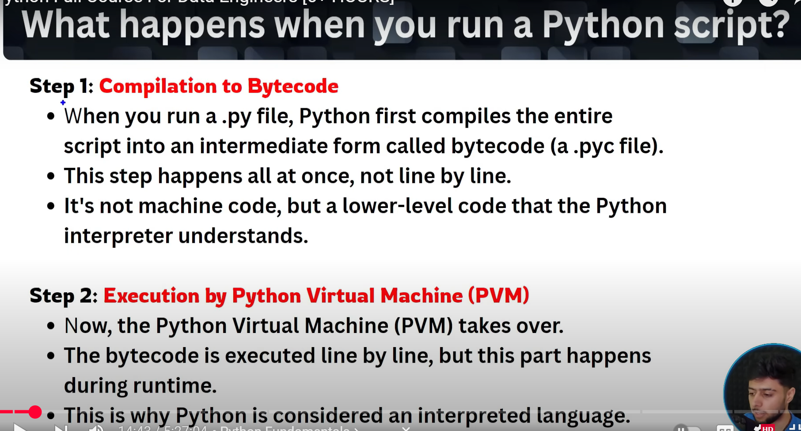
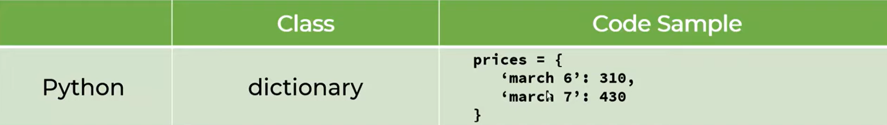
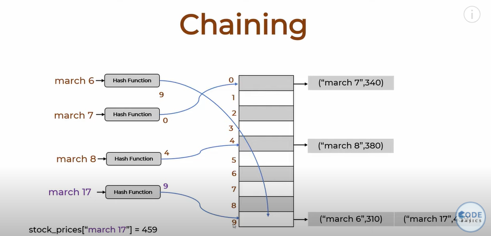

Open Powershell under the user context in which the Job runs# **Chapter 1**

## **What is Programming**?
Programming is the process of creating instructions that a computer can follow to perform specific tasks. These instructions are written in a programming language, which is a set of rules and syntax that allows humans to communicate with computers.  
Some common programming languages include Python, Java, C++, and JavaScript. Programmers use these languages to write code that can range from simple scripts to complex software applications.

## **What is Python**?
Python is a high-level, interpreted programming language known for its simplicity and readability. Python's design philosophy emphasizes code readability and ease of use, making it a popular choice for both beginners and experienced programmers.

## **Features of Python**
- **High-level language**: Python abstracts away most of the complex details of the computer's hardware, allowing you to focus on programming logic rather than low-level operations.
- **Portable**: Python code can run on various platforms without modification, including Windows, macOS, Linux, and more.
- **Free and open source**: Python is freely available to use and distribute. Its source code is open for anyone to view, modify, and contribute to, fostering a collaborative development environment.

## **Disadvantages of Python**
While Python has many advantages, it also has some drawbacks:
- **Performance**: Python is generally slower than compiled languages like C++ or Java because it is an interpreted language. This can be a disadvantage for applications that require high-speed processing.
- **Memory Consumption**: Python can consume more memory compared to other languages, which might be an issue for memory-intensive applications.
- **Mobile Development**: Python is not commonly used for mobile app development. Languages like Swift (for iOS) and Kotlin (for Android) are more popular in this domain.
- **Runtime Errors**: Python is dynamically typed, which means errors can occur at runtime if the code is not thoroughly tested. This can lead to issues that are harder to debug.

## **Compiler vs Interpreter**

| Feature             | Compiler                                      | Interpreter                                   |
| ------------------- | --------------------------------------------- | --------------------------------------------- |
| **Translation**     | Translates entire code at once                | Translates code line-by-line                  |
| **Execution Speed** | Generally faster execution                    | Generally slower execution                    |
| **Error Detection** | Errors detected after entire code is compiled | Errors detected line-by-line during execution |
| **Output**          | Generates an executable file                  | Executes code directly                        |
| **Usage**           | Used for languages like C, C++                | Used for languages like Python, JavaScript    |

## **Low-Level Language vs High-Level Language**

| Feature               | Low-Level Language                  | High-Level Language                 |
| --------------------- | ----------------------------------- | ----------------------------------- |
| **Abstraction Level** | Close to machine code               | Close to human language             |
| **Ease of Use**       | Difficult to write and understand   | Easier to write and understand      |
| **Portability**       | Machine-specific                    | Portable across different machines  |
| **Examples**          | Assembly language, Machine code     | Python, Java, C++                   |
| **Control**           | Provides high control over hardware | Provides less control over hardware |



## **Modules in Python**
A module in Python is a file containing Python code, which can include functions, classes, and variables. Modules help organize code into manageable sections and promote code reuse across different projects.

### **Types of Modules**

**1. Built-in Modules**
- These are modules that come pre-installed with Python.
- Examples: `math`, `os`, `sys`, `datetime`.

**2. User-Defined Modules**
   - These are modules created by users to organize their code.
   - Example: A file named `mymodule.py` containing custom functions and classes.

**3. External Modules**
   - These are modules developed by the Python community and can be installed using package managers like `pip`.
   - Examples: `requests`, `numpy`, `pandas`.

## **Pip**
**Pip** is the package installer for Python. It allows you to install and manage additional libraries and dependencies that are not included in the standard Python library. Here's a brief overview:

### **Installing Pip**
Pip usually comes pre-installed with Python. You can check if pip is installed by running:
```sh
pip --version
```
If it's not installed, you can install it by following the instructions on the official pip website.

**1. Installing Packages**
To install a package using pip, use the following command:
```sh
pip install package_name
```
For example, to install the `requests` library:
```sh
pip install requests
```

**2. Upgrading Packages**
To upgrade an installed package to the latest version:
```sh
pip install --upgrade package_name
```

**3. Uninstalling Packages**
To uninstall a package:
```sh
pip uninstall package_name
```

**4. Listing Installed Packages**
To list all installed packages:
```sh
pip list
```

## **Print**
1. We can use both single quotes and double quotes
    ```python
    print('Hello World')
    print("Hello World")
    print('Hello World',3,"Mohan")
    ```
2. When we want print text to next line without using escape character use thriple quotes
    ```python
    print('''Hello World
    How are you''')
    print("""Hello World
    How are you""")
    ```
3. Use backslash when you want to the use character which are not considered as literals
    ```python
    print('\'Hello World\'')
    ```

4. When you want print with delimeter use **sep** in print
    ```python
    print("Mohan",123,"Hello",sep="-") #Output: Mohan-123-hello
    ```

## **Multiline Code**
When we want write code in multiple line we can make use of backslash(\\)
```python
a = 1 + 2 + 3\
  4 + 5
```
___
# **Chapter 2**

## **Variables**
- **Definition**: Variables are used to store data that can be manipulated and referenced in a program.
- **Naming**: Variable names should be descriptive and follow certain rules (see Identifiers below).
- **Example**:
  ```python
  age = 25
  name = "Alice"
  ```

## **Keywords**
- **Definition**: Keywords are reserved words in Python that have special meanings and cannot be used as variable names.
- **Examples**: `if`, `else`, `while`, `for`, `def`, `class`, `import`, `return`, `True`, `False`, `None`, etc.
- **Usage**:
  ```python
  if age > 18:
      print("Adult")
  ```

## **Identifiers**
- **Definition**: Identifiers are names used to identify variables, functions, classes, modules, and other objects in Python.
- **Rules for Defining Identifiers**:
  - **Start with a letter or underscore**: Identifiers must begin with a letter (a-z, A-Z) or an underscore (_).
  - **Followed by letters, digits, or underscores**: After the first character, identifiers can include letters, digits (0-9), or underscores.
  - **Case-sensitive**: Identifiers are case-sensitive (`age` and `Age` are different).
  - **No spaces or special characters**: Identifiers cannot contain spaces or special characters like `@`, `#`, `$`, etc.
  - **Avoid keywords**: Identifiers should not be the same as Python keywords.

- **Examples**:
  ```python
  valid_identifier = 10
  _underscore_start = "Hello"
  camelCaseIdentifier = 3.14
  ```

## **Summary**
- **Variables**: Store data and follow naming rules.
- **Keywords**: Reserved words with special meanings, cannot be used as identifiers.
- **Identifiers**: Names for variables, functions, etc., following specific rules.

## **Datatypes**:

**1. Numeric Types**
- **int**: Represents integers, e.g., `5`, `-3`.
- **float**: Represents floating-point numbers, e.g., `3.14`, `-0.001`.

**2. Sequence Types**
- **str**: Represents strings, e.g., `"Hello, World!"`.
- **list**: Represents ordered collections, e.g., `[1, 2, 3, 4]`.
- **tuple**: Represents immutable ordered collections, e.g., `(1, 2, 3, 4)`.

**3. Set Types**
- **set**: Represents unordered collections of unique elements, e.g., `{1, 2, 3, 4}`.

**4. Mapping Types**
- **dict**: Represents key-value pairs, e.g., `{"name": "Alice", "age": 25}`.

**5. Boolean Type**
- **bool**: Represents `True` or `False`.

**6. None Type**
- **NoneType**: Represents the absence of a value, e.g., `None`.

**Examples**
```python
# Numeric Types
a = 5          # int
b = 3.14       # float

# Sequence Types
s = "Hello"    # str
lst = [1, 2, 3] # list
tup = (1, 2, 3) # tuple

# Set Types
st = {1, 2, 3} # set

# Mapping Types
d = {"name": "Alice", "age": 25} # dict

# Boolean Type
flag = True    # bool

# None Type
x = None       # NoneType
```

## **Operators in Python**:

**1. Arithmetic Operators**
- **Addition (`+`)**: Adds two operands, e.g., `a + b`.
- **Subtraction (`-`)**: Subtracts the second operand from the first, e.g., `a - b`.
- **Multiplication (`*`)**: Multiplies two operands, e.g., `a * b`.
- **Division (`/`)**: Divides the first operand by the second, e.g., `a / b`.
- **Floor Division (`//`)**: Divides and returns the largest integer less than or equal to the result, e.g., `a // b`.
- **Modulus (`%`)**: Returns the remainder of the division, e.g., `a % b`.
- **Exponentiation (`**`)**: Raises the first operand to the power of the second, e.g., `a ** b`.

**2. Comparison Operators**
- **Equal (`==`)**: Checks if two operands are equal, e.g., `a == b`.
- **Not Equal (`!=`)**: Checks if two operands are not equal, e.g., `a != b`.
- **Greater Than (`>`)**: Checks if the first operand is greater than the second, e.g., `a > b`.
- **Less Than (`<`)**: Checks if the first operand is less than the second, e.g., `a < b`.
- **Greater Than or Equal To (`>=`)**: Checks if the first operand is greater than or equal to the second, e.g., `a >= b`.
- **Less Than or Equal To (`<=`)**: Checks if the first operand is less than or equal to the second, e.g., `a <= b`.

**3. Logical Operators**
- **AND (`and`)**: Returns `True` if both operands are true, e.g., `a and b`.
- **OR (`or`)**: Returns `True` if at least one operand is true, e.g., `a or b`.
- **NOT (`not`)**: Returns `True` if the operand is false, e.g., `not a`.

**4. Bitwise Operators**
- **AND (`&`)**: Performs bitwise AND, e.g., `a & b`.
- **OR (`|`)**: Performs bitwise OR, e.g., `a | b`.
- **XOR (`^`)**: Performs bitwise XOR, e.g., `a ^ b`.
- **NOT (`~`)**: Performs bitwise NOT, e.g., `~a`.
- **Left Shift (`<<`)**: Shifts bits to the left, e.g., `a << b`.
- **Right Shift (`>>`)**: Shifts bits to the right, e.g., `a >> b`.

**5. Assignment Operators**
- **Assign (`=`)**: Assigns a value to a variable, e.g., `a = b`.
- **Add and Assign (`+=`)**: Adds and assigns, e.g., `a += b`.
- **Subtract and Assign (`-=`)**: Subtracts and assigns, e.g., `a -= b`.
- **Multiply and Assign (`*=`)**: Multiplies and assigns, e.g., `a *= b`.
- **Divide and Assign (`/=`)**: Divides and assigns, e.g., `a /= b`.
- **Floor Divide and Assign (`//=`)**: Floor divides and assigns, e.g., `a //= b`.
- **Modulus and Assign (`%=`)**: Modulus and assigns, e.g., `a %= b`.
- **Exponentiate and Assign (`**=`)**: Exponentiates and assigns, e.g., `a **= b`.
- **Bitwise AND and Assign (`&=`)**: Bitwise AND and assigns, e.g., `a &= b`.
- **Bitwise OR and Assign (`|=`)**: Bitwise OR and assigns, e.g., `a |= b`.
- **Bitwise XOR and Assign (`^=`)**: Bitwise XOR and assigns, e.g., `a ^= b`.
- **Left Shift and Assign (`<<=`)**: Left shifts and assigns, e.g., `a <<= b`.
- **Right Shift and Assign (`>>=`)**: Right shifts and assigns, e.g., `a >>= b`.

**6. Identity Operators**
- **Is (`is`)**: Checks if two variables point to the same object, e.g., `a is b`.
- **Is Not (`is not`)**: Checks if two variables do not point to the same object, e.g., `a is not b`.

**7. Membership Operators**
- **In (`in`)**: Checks if a value is present in a sequence, e.g., `a in b`.
- **Not In (`not in`)**: Checks if a value is not present in a sequence, e.g., `a not in b`.

**Examples**
```python
# Arithmetic Operators
a = 10
b = 3
print(a + b)  # 13
print(a - b)  # 7
print(a * b)  # 30
print(a / b)  # 3.3333333333333335
print(a // b) # 3
print(a % b)  # 1
print(a ** b) # 1000

# Comparison Operators
print(a == b) # False
print(a != b) # True
print(a > b)  # True
print(a < b)  # False
print(a >= b) # True
print(a <= b) # False

# Logical Operators
print(a > 5 and b < 5) # True
print(a > 5 or b > 5)  # True
print(not(a > 5))      # False

# Bitwise Operators
print(a & b)  # 2
print(a | b)  # 11
print(a ^ b)  # 9
print(~a)     # -11
print(a << b) # 80
print(a >> b) # 1

# Assignment Operators
a,b,c = 5,10,15
print(a,b,c)  #5 10 15
a,b,c = 5
print(a,b,c)  #5 5 5
a += b
print(a)      # 13
a -= b
print(a)      # 10
a *= b
print(a)      # 30
a /= b
print(a)      # 10.0

# Identity Operators
print(a is b)     # False
print(a is not b) # True

# Membership Operators
lst = [1, 2, 3, 4]
print(3 in lst)   # True
print(5 not in lst) # True
```

## **Type**
- **Purpose**: Determines the type of an object.
- **Usage**: The `type()` function is used to get the type of an object.
- **Example**:
  ```python
  a = 5
  print(type(a))  # Output: <class 'int'>
  
  b = "Hello"
  print(type(b))  # Output: <class 'str'>
  ```

## **Typecasting**
- **Purpose**: Converts one data type to another.
- **Usage**: Various functions are used for typecasting, such as `int()`, `float()`, `str()`, `list()`, `tuple()`, etc.
- **Examples**:
  ```python
  # Converting string to integer
  s = "123"
  i = int(s)
  print(i)  # Output: 123
  print(type(i))  # Output: <class 'int'>
  
  # Converting integer to string
  n = 456
  s = str(n)
  print(s)  # Output: "456"
  print(type(s))  # Output: <class 'str'>
  
  # Converting list to tuple
  lst = [1, 2, 3]
  tup = tuple(lst)
  print(tup)  # Output: (1, 2, 3)
  print(type(tup))  # Output: <class 'tuple'>
  ```

## **Input**
- **Purpose**: Takes input from the user.
- **Usage**: The `input()` function is used to read a string from the user.
- **Example**:
  ```python
  name = input("Enter your name: ")
  print("Hello, " + name + "!")
  ```
- **Typecasting with Input**: Since `input()` returns a string, you may need to typecast it to the desired type.
  ```python
  age = input("Enter your age: ")
  age = int(age)  # Typecasting string to integer
  print("You are " + str(age) + " years old.")
  ```
___
# **Chapter 3**
## **Strings**
**Definition**: A sequence of characters enclosed in quotes (`' '` or `" "`). Strings in Python are immutable. This means that once a string is created, it cannot be changed. Any operation that modifies a string will actually create a new string rather than modifying the original one.

**Example**: 
```python
my_string = "Hello, World!"
```

### **String Slicing**:  
String slicing is a powerful feature in Python that allows you to access a portion (substring) of a string. Here's a detailed look at how it works:
```python
string[start:end:step]
```
- **start**: The starting index of the slice (inclusive).
- **end**: The ending index of the slice (exclusive).
- **step**: The step size (optional).

**1. Basic Slicing**
```python
s = "Hello, World!"
print(s[0:5])  # Output: "Hello"
print(s[7:12]) # Output: "World"
```

**2. Omitting Start or End**
- **Omitting start**: Starts from the beginning of the string.
- **Omitting end**: Goes till the end of the string.
```python
print(s[:5])   # Output: "Hello" (same as s[0:5])
print(s[7:])   # Output: "World!" (same as s[7:13])
```

**3. Negative Indexing**
- **Negative indices**: Count from the end of the string.
```python
print(s[-6:-1]) # Output: "World"
print(s[-6:])   # Output: "World!"
```

**4. Using Step**
- **Step**: Specifies the interval between elements.
```python
print(s[::2])   # Output: "Hlo ol!" (every second character)
print(s[1::2])  # Output: "el,Wrd" (every second character starting from index 1)
```

**5. Reversing a String**
- **Reverse**: Use a negative step. When using a negative step, Python expects the start index to be greater than the end index to move backwards.
```python
print(s[::-1])  # Output: "!dlroW ,olleH"
```

### **String Methods**:
- `my_string.capitalize()`: Capitalizes the first character of the string.
  ```python
  print(my_string.capitalize())  # Output: "Hello, world!"
  ```
- `my_string.title()`: Capitalizes the first character of each word.
  ```python
  print(my_string.title())  # Output: "Hello, World!"
  ```
- `my_string.startswith(substring)`: Checks if the string starts with the specified substring.
  ```python
  print(my_string.startswith("Hello"))  # Output: True
  ```
- `my_string.endswith(substring)`: Checks if the string ends with the specified substring.
  ```python
  print(my_string.endswith("World!"))  # Output: True
  ```
- `my_string.isdigit()`: Checks if all characters in the string are digits.
  ```python
  print("12345".isdigit())  # Output: True
  ```
- `string.count()`: The `count()` method returns the number of occurrences of a substring in the string.
  ```python
  string.count(substring, start=0, end=len(string))
  ```
  - **substring**: The substring to count.
  - **start**: (Optional) The starting index to begin the search.
  - **end**: (Optional) The ending index to end the search.
  ```python
  text = "Hello, World! Hello, Python!"
  count_hello = text.count("Hello")
  print(count_hello)  # Output: 2
  ```
- `string.find()`
The `find()` method returns the lowest index of the substring if it is found in the string. If the substring is not found, it returns `-1`.
  ```python
  string.find(substring, start=0, end=len(string))
  ```
  - **substring**: The substring to find.
  - **start**: (Optional) The starting index to begin the search.
  - **end**: (Optional) The ending index to end the search.
  ```python
  text = "Hello, World!"
  index_world = text.find("World")
  print(index_world)  # Output: 7
  ```
- `string.replace()`
The `replace()` method returns a copy of the string with all occurrences of a substring replaced by another substring.
  ```python
  string.replace(old, new, count=-1)
  ```
  - **old**: The substring to be replaced.
  - **new**: The substring to replace with.
  - **count**: (Optional) The number of occurrences to replace. If omitted, all occurrences are replaced.
  ```python
  text = "Hello, World! Hello, Python!"
  replaced_text = text.replace("Hello", "Hi")
  print(replaced_text)  # Output: Hi, World! Hi, Python!
  ```

### **Common Escape Sequences**
Escape sequence characters in Python are used to represent special characters within strings. They allow you to include characters that are otherwise difficult to type directly.

**1. Newline (`\n`)**:
- Inserts a newline character.
- Example:
```python
text = "Hello,\nWorld!"
print(text)
# Output:
# Hello,
# World!
```

**2. Tab (`\t`)**:
- Inserts a tab character.
- Example:
 ```python
 text = "Hello,\tWorld!"
 print(text)
 # Output: Hello,   World!
 ```

**3. Backslash (`\\`)**:
- Inserts a literal backslash.
- Example:
 ```python
 text = "This is a backslash: \\"
 print(text)
 # Output: This is a backslash: \
 ```

**4. Single Quote (`\'`)**:
- Inserts a single quote.
- Example:
 ```python
 text = 'It\'s a beautiful day!'
 print(text)
 # Output: It's a beautiful day!
 ```

**5. Double Quote (`\"`)**:
- Inserts a double quote.
- Example:
 ```python
 text = "He said, \"Hello!\""
 print(text)
 # Output: He said, "Hello!"
 ```

**6. Unicode Characters (`\uXXXX`)**:
- Inserts a Unicode character.
- Example:
 ```python
 text = "Unicode: \u2764"
 print(text)
 # Output: Unicode: ❤
 ```

## **Lists**
- A list is a collection of items in a particular order.
- Lists are mutable, meaning you can change their content without changing their identity.
- Lists can contain items of different data types (integers, strings, etc.).

### **Creating a List:**
You can create a list by placing all the items inside square brackets `[]`, separated by commas.
```python
my_list = [1, 2, 3, 4, 5]
```

### **Accessing Elements:**
Access elements using their index like strings, starting from 0.
```python
print(my_list[0])  # Output: 1
```

### **Modifying Elements:**
Change the value of an element by accessing it via its index.
```python
my_list[0] = 10
print(my_list)  # Output: [10, 2, 3, 4, 5]
```

### **List Operations:**
- Concatenation: Combine two lists using the `+` operator.
```python
list1 = [1, 2, 3]
list2 = [4, 5, 6]
combined_list = list1 + list2
print(combined_list)  # Output: [1, 2, 3, 4, 5, 6]
```
- Repetition: Repeat a list using the `*` operator.
```python
repeated_list = list1 * 2
print(repeated_list)  # Output: [1, 2, 3, 1, 2, 3]
```

### **List Comprehensions:**
- A concise way to create lists.
```python
squares = [x**2 for x in range(10)]
print(squares)  # Output: [0, 1, 4, 9, 16, 25, 36, 49, 64, 81]
```

### **Common List Methods**
| **Method**  | **Description**                                                                                             | **Syntax**                    | **Example**                                                                      |
| ----------- | ----------------------------------------------------------------------------------------------------------- | ----------------------------- | -------------------------------------------------------------------------------- |
| `append()`  | Adds an element to the end of the list                                                                      | `list.append(element)`        | `my_list.append(6)`<br>`print(my_list)`<br>`# Output: [1, 2, 3, 4, 5, 6]`        |
| `insert()`  | Inserts an element at a specified index                                                                     | `list.insert(index, element)` | `my_list.insert(1, 'a')`<br>`print(my_list)`<br>`# Output: [1, 'a', 2, 3, 4, 5]` |
| `remove()`  | Removes the first occurrence of a value                                                                     | `list.remove(value)`          | `my_list.remove(2)`<br>`print(my_list)`<br>`# Output: [1, 3, 4, 5]`              |
| `pop()`     | Removes and returns the element at the specified index (default is the last element)                        | `list.pop([index])`           | `my_list.pop()`<br>`print(my_list)`<br>`# Output: [1, 2, 3, 4]`                  |
| `clear()`   | Removes all elements from the list                                                                          | `list.clear()`                | `my_list.clear()`<br>`print(my_list)`<br>`# Output: []`                          |
| `index()`   | Returns the index of the first element with the specified value                                             | `list.index(value)`           | `my_list.index(3)`<br>`# Output: 2`                                              |
| `count()`   | Returns the number of elements with the specified value                                                     | `list.count(value)`           | `my_list.count(2)`<br>`# Output: 1`                                              |
| `sort()`    | Sorts the list in ascending order.<br>Sorts the list in descending order: `my_list.sort(reverse=True)`</br> | `list.sort()`                 | `my_list.sort()`<br>`print(my_list)`<br>`# Output: [1, 2, 3, 4, 5]`              |
| `reverse()` | Reverses the order of the list                                                                              | `list.reverse()`              | `my_list.reverse()`<br>`print(my_list)`<br>`# Output: [5, 4, 3, 2, 1]`           |
| `copy()`    | Returns a shallow copy of the list                                                                          | `list.copy()`                 | `new_list = my_list.copy()`<br>`print(new_list)`<br>`# Output: [1, 2, 3, 4, 5]`  |

**Let's break down the differences between <mark>new_list = my_list.copy()</mark> and <mark>new_list = my_list</mark>:**  
This case is valid when objects are mutable
#### `new_list = my_list.copy()`
- **Creates a Shallow Copy:** This method creates a new list that is a shallow copy of `my_list`. This means `new_list` will have the same elements as `my_list`, but it will be a separate object in memory.
- **Independent Lists:** Changes made to `new_list` will not affect `my_list`, and vice versa.
- **Syntax:**
  ```python
  my_list = [1, 2, 3]
  new_list = my_list.copy()
  new_list.append(4)
  print(my_list)  # Output: [1, 2, 3]
  print(new_list)  # Output: [1, 2, 3, 4]
  ```

#### `new_list = my_list`
- **Creates a Reference:** This method does not create a new list. Instead, `new_list` becomes a reference to `my_list`. Both `new_list` and `my_list` point to the same list object in memory.
- **Linked Lists:** Changes made to `new_list` will also affect `my_list`, and vice versa.
- **Syntax:**
  ```python
  my_list = [1, 2, 3]
  new_list = my_list
  new_list.append(4)
  print(my_list)  # Output: [1, 2, 3, 4]
  print(new_list)  # Output: [1, 2, 3, 4]
  ```

### **Summary:**
- **`my_list.copy()`**: Creates a new, independent list.
- **`my_list`**: Creates a reference to the same list.

### **List Comprehension in Python**
List comprehension is a concise way to create lists in Python. It offers a shorter syntax when you want to create a new list based on the values of an existing list or iterable.

```py
[expression for item in iterable]
```

**Examples**

**1. Create a list of squares**
```python
squares = [x**2 for x in range(5)]
# Output: [0, 1, 4, 9, 16]
```

**2. Filter even numbers**
```python
evens = [x for x in range(10) if x % 2 == 0]
# Output: [0, 2, 4, 6, 8]
```

**3. Apply a function to each element**
```python
words = ["hello", "world"]
upper_words = [word.upper() for word in words]
# Output: ['HELLO', 'WORLD']
```

**4. If-Else in Expression**
```python
labels = ["even" if x % 2 == 0 else "odd" for x in range(5)]
# Output: ['even', 'odd', 'even', 'odd', 'even']
```

**5. Nested List Comprehension**
```python
matrix = [[i * j for j in range(3)] for i in range(3)]
# Output: [[0, 0, 0], [0, 1, 2], [0, 2, 4]]
```

## **Tuple**
- **Definition**: A tuple is an ordered collection of elements, which can be of different types. Unlike lists, tuples are immutable, meaning once created, their elements cannot be changed.
- **Syntax**: Tuples are defined by enclosing the elements in parentheses `()` and separating them with commas.

### **Creating Tuples**
```python
# Creating a tuple
my_tuple = (1, 2, 3)
# Tuple with mixed data types
mixed_tuple = (1, "Hello", 3.14)
# Single element tuple (note the comma)
single_element_tuple = (1,)
```

### **Converting tuple to list**
```python
num = (1,2,3,4,"mohan")
num_list = list(num)
```

### **Accessing Tuple Elements**
- **Indexing**: Access elements using their index, starting from 0.
```python
print(my_tuple[0])  # Output: 1
```
- **Negative Indexing**: Access elements from the end of the tuple.
```python
print(my_tuple[-1])  # Output: 3
```

### **Tuple Operations**
- **Concatenation**: Combine tuples using the `+` operator.
```python
tuple1 = (1, 2)
tuple2 = (3, 4)
combined_tuple = tuple1 + tuple2  # Output: (1, 2, 3, 4)
```
- **Repetition**: Repeat elements using the `*` operator.
```python
repeated_tuple = tuple1 * 3  # Output: (1, 2, 1, 2, 1, 2)
```

### **Tuple Methods**
- **count()**: Returns the number of times a specified value appears in the tuple.
```python
my_tuple = (1, 2, 2, 3)
print(my_tuple.count(2))  # Output: 2
```
- **index()**: Returns the index of the first occurrence of a specified value.
```python
print(my_tuple.index(3))  # Output: 3
```

### **Advantages of Tuples**
- **Immutability**: Provides data integrity by preventing accidental changes.
- **Performance**: Tuples are generally faster than lists due to their immutability.
- **Hashable**: Tuples can be used as keys in dictionaries, unlike lists.

### **Use Cases**
- **Fixed Data**: Ideal for storing data that should not change, like coordinates or database records.
- **Dictionary Keys**: Useful when you need a composite key for a dictionary.

## **Dictionary**
- **Definition**: A dictionary is an unordered collection of items. Each item is a key-value pair, where the key is unique.
- **Syntax**: Dictionaries are defined by enclosing key-value pairs in curly braces `{}`.

### **Creating Dictionaries**
```python
# Creating an empty dictionary
my_dict = {}

# Creating a dictionary with initial values
my_dict = {
    "name": "Alice",
    "age": 25,
    "city": "New York"
}
```

### **Accessing Dictionary Elements**
- **Using Keys**: Access values by their keys.
```python
print(my_dict["name"])  # Output: Alice
```
- **Using `get()` Method**: Access values using the `get()` method to avoid errors if the key does not exist.
```python
print(my_dict.get("age"))  # Output: 25
print(my_dict.get("country", "Not Found"))  # Output: Not Found
```

### **Modifying Dictionaries**
- **Adding/Updating Elements**: Add new key-value pairs or update existing ones.
```python
my_dict["email"] = "alice@example.com"  # Adding a new key-value pair
my_dict["age"] = 26  # Updating an existing key-value pair
```
- **Removing Elements**: Remove elements using `pop()`, `del`, or `popitem()`.
```python
my_dict.pop("city")  # Removes the key "city" and returns its value
del my_dict["email"]  # Removes the key "email"
my_dict.popitem()  # Removes and returns the last inserted key-value pair
```

### **Dictionary Methods**
- **keys()**: Returns a view object of all keys.
```python
print(my_dict.keys())  # Output: dict_keys(['name', 'age'])
```
- **values()**: Returns a view object of all values.
```python
print(my_dict.values())  # Output: dict_values(['Alice', 26])
```
- **items()**: Returns a view object of all key-value pairs.
```python
print(my_dict.items())  # Output: dict_items([('name', 'Alice'), ('age', 26)])
```
- **update()**: Updates the dictionary with elements from another dictionary or from an iterable of key-value pairs.
```python
my_dict.update({"city": "Los Angeles", "email": "alice@example.com"})
```

### **Looping Through Dictionaries**
- **Loop through keys**:
```python
for key in my_dict:
    print(key, my_dict[key])
```
- **Loop through key-value pairs**:
```python
for key, value in my_dict.items():
    print(key, value)
```

### **Dictionary Comprehensions**
- **Creating dictionaries using comprehensions**:
```python
squares = {x: x*x for x in range(6)}
print(squares)  # Output: {0: 0, 1: 1, 2: 4, 3: 9, 4: 16, 5: 25}
```

### **Advantages of Dictionaries**
- **Fast Lookups**: Average time complexity for lookups is O(1).
- **Flexible Keys**: Keys can be of any immutable type (e.g., strings, numbers, tuples).

### **Use Cases**
- **Data Representation**: Ideal for representing structured data (e.g., JSON).
- **Counting/Grouping**: Useful for counting occurrences or grouping data.

## **Sets**
- **Definition**: A set is a collection which is unordered, unchangeable*, and unindexed.
Set items are unchangeable, but you can remove items and add new items.

**Note**:   
1. The values True and 1 are considered the same value in sets, and are treated as duplicates:
2. The values False and 0 are considered the same value in sets, and are treated as duplicates:

```python
# Creating an empty set
- **Example**: 
  ```python
  s = set()
  ```
- **Additional Methods**:
  - `my_set.discard(item)`: Removes the item from the set if it exists.
    ```python
    my_set.discard("apple")
    print(my_set)  # Output: {1, 2, 3, 4.5}
    ```
  - `my_set.update(iterable)`: Adds all items from the iterable to the set.
    ```python
    my_set.update([5, 6])
    print(my_set)  # Output: {1, 2, 3, 4.5, 5, 6}
    ```
  - `my_set.symmetric_difference(other_set)`: Returns a new set with elements in either set but not both.
    ```python
    other_set = {3, 4, 5}
    sym_diff_set = my_set.symmetric_difference(other_set)
    print(sym_diff_set)  # Output: {1, 2, 4.5, 4, 6}
    ```

# **Chapter 4**

## **Conditional Statements**
Conditional statements in Python are used to execute code based on certain conditions. Python supports several types of conditional statements:
**1. if statement**
**2. if-else statement**
**3. if-elif-else statement**
**4. nested if statements**

**1. `if` Statement**
Executes a block of code if the condition is `True`.
```python
x = 10
if x > 5:
    print("x is greater than 5")
```

**2. `if-else` Statement**
Executes one block of code if the condition is `True`, and another block if the condition is `False`.
```python
x = 10
if x > 5:
    print("x is greater than 5")
else:
    print("x is not greater than 5")
```

**3. `if-elif-else` Statement**
Allows checking multiple conditions.
```python
x = 10
if x > 15:
    print("x is greater than 15")
elif x > 5:
    print("x is greater than 5 but less than or equal to 15")
else:
    print("x is 5 or less")
```

**4. Nested `if` Statements**
You can nest `if` statements within other `if` statements.
```python
x = 10
if x > 5:
    if x > 8:
        print("x is greater than 8")
    else:
        print("x is greater than 5 but less than or equal to 8")
else:
    print("x is 5 or less")
```

### **Conditional Expression**
Conditional expressions in Python, also known as ternary operators, allow you to write concise conditional statements. The basic syntax for a conditional expression is:
```python
value_if_true if condition else value_if_false
```

**Example**
```python
x = 10
result = "Even" if x % 2 == 0 else "Odd"
print(result)  # Output: Even
```

**Explanation**
- **condition**: The expression that is evaluated to determine which value to return.
- **value_if_true**: The value returned if the condition is `True`.
- **value_if_false**: The value returned if the condition is `False`.

**Use Cases**
Conditional expressions are useful for:
- Simplifying simple `if-else` statements.
- Making code more readable and concise.

### **Nested Conditional Expressions**
You can also nest conditional expressions:
```python
x = 10
result = "Positive" if x > 0 else "Negative" if x < 0 else "Zero"
print(result)  # Output: Positive
```

### **Difference between Conditional Expression and Conditional Statement**

| Feature                | Conditional Expression                           | Conditional Statement                       |
| ---------------------- | ------------------------------------------------ | ------------------------------------------- |
| **Syntax**             | `value_if_true if condition else value_if_false` | Uses `if`, `elif`, and `else` keywords      |
| **Purpose**            | Returns a value based on a condition             | Executes blocks of code based on conditions |
| **Return vs. Execute** | Returns a value                                  | Executes code blocks                        |

## **Loops**

### **1. for Loop**
The `for` loop is used for iterating over a sequence (like a list, tuple, dictionary, set, or string).

**Syntax:**
```python
for variable in sequence:
    # code to execute
```

**Example:**
```python
fruits = ["apple", "banana", "cherry"]
for fruit in fruits:
    print(fruit)
```

### **2. while Loop**
The `while` loop continues to execute as long as the condition is true.

**Syntax:**
```python
while condition:
    # code to execute
```

**Example:**
```python
count = 0
while count < 5:
    print(count)
    count += 1
```

### **3. for-else Loop**
The `for-else` construct in Python is a unique feature that allows you to execute a block of code when the loop completes normally (i.e., not terminated by a `break` statement).

**Syntax:**
```python
for variable in sequence:
    # code to execute
else:
    # code to execute if the loop completes normally
```

**Example:**
```python
numbers = [1, 2, 3, 4, 5]

for number in numbers:
    if number == 3:
        print("Found 3!")
        break
else:
    print("3 not found in the list.")
```

In this example, if the number `3` is found in the list, the loop breaks, and the `else` block is not executed. If the loop completes without finding `3`, the `else` block is executed.

**Use Case:**
The `for-else` construct is particularly useful when searching for an item in a sequence and needing to perform an action if the item is not found.

**Example:**
```python
primes = [2, 3, 5, 7, 11, 13]

for prime in primes:
    if prime == 9:
        print("Found 9!")
        break
else:
    print("9 is not a prime number.")
```

In this case, since `9` is not in the list of primes, the `else` block is executed, printing "9 is not a prime number."

### **4. Loop Control Statements**
These statements change the execution from its normal sequence.

- **`break`**: Terminates the loop.
- **`continue`**: Skips the rest of the code inside the loop for the current iteration.
- **`pass`**: Does nothing, acts as a placeholder. 

**Examples:**
```python
# break example
for i in range(10):
    if i == 5:
        break
    print(i)

# continue example
for i in range(10):
    if i % 2 == 0:
        continue
    print(i)

# pass example: If we remove pass keyword then code will show an Indentation Error.
for i in range(10):
    if i == 5:
        pass
    print(i)
```

### **5. Nested Loops**
You can use one loop inside another loop.

**Example:**
```python
for i in range(3):
    for j in range(2):
        print(f"i: {i}, j: {j}")
```

### **6. Looping through a Dictionary**
You can loop through a dictionary using `items()`, `keys()`, and `values()` methods.

**Example:**
```python
person = {"name": "John", "age": 30, "city": "New York"}
for key, value in person.items():
    print(f"{key}: {value}")
```

### **7. Range function**
The `range` function in Python is used to generate a sequence of numbers. It's commonly used in `for` loops to iterate over a sequence of numbers.

**Syntax:**
```python
range(start, stop, step)
```

- **`start`**: The starting number of the sequence (inclusive). Default is 0.
- **`stop`**: The ending number of the sequence (exclusive).
- **`step`**: The difference between each number in the sequence. Default is 1.

**Examples:**

**1. Basic Usage:**
  ```python
  for i in range(5):
      print(i)
  ```
  Output:
  ```
  0
  1
  2
  3
  4
  ```
  Here, `range(5)` generates numbers from 0 to 4.

**2. Specifying `start` and `stop`:**
  ```python
  for i in range(2, 6):
      print(i)
  ```
  Output:
  ```
  2
  3
  4
  5
  ```
  Here, `range(2, 6)` generates numbers from 2 to 5.

**3. Specifying `start`, `stop`, and `step`:**
  ```python
  for i in range(1, 10, 2):
      print(i)
  ```
  Output:
  ```
  1
  3
  5
  7
  9
  ```
  Here, `range(1, 10, 2)` generates numbers from 1 to 9, with a step of 2.

**4. Using `range` with negative `step`:**
  ```python
  for i in range(10, 0, -2):
      print(i)
  ```
  Output:
  ```
  10
  8
  6
  4
  2
  ```
  Here, `range(10, 0, -2)` generates numbers from 10 to 2, with a step of -2.

# **Chapter 5**

## **Functions**

Functions are reusable blocks of code designed to perform a specific task. They help in breaking down complex problems into smaller, manageable parts, improving code readability, reusability, and maintainability.

Python supports:
- Built-in functions (like `len()`, `print()`)
- User-defined functions (created using `def`)
- Anonymous functions (using `lambda`)
- Higher-order functions (like `map()`, `filter()`, `reduce()`)

### **1. Basic Syntax of Functions**
```python
def function_name(parameters):
    """Optional docstring"""
    # Code block
    return value  # Optional
```
**Example:**
```python
def greet():
    print("Welcome to Python Functions!")

greet()
```

### **2. Parameterized Function**

Functions can accept parameters to work with dynamic input.

**Example:**
```python
def greet_user(name, age):
    print(f"Hello {name}, you are {age} years old.")

greet_user("Alice", 30)
```

### **3. Inbuilt vs User-Defined Functions**

**Inbuilt Functions:**  
Provided by Python. Examples: `len()`, `sum()`, `type()`

```python
print(len("Python"))  # Output: 6
```

**User-Defined Functions:**  
Created by the programmer.

```python
def multiply(a, b):
    return a * b

print(multiply(4, 5))  # Output: 20
```

### **4. Return Value from Function**

Functions can return values using `return`.

**Example:**
```python
def calculate_area(length, width):
    return length * width

area = calculate_area(5, 3)
print("Area:", area)
```
In Python, a function can return multiple values by separating them with commas. Internally, Python packs these values into a tuple.

```python
def calculate_stats(numbers):
    total = sum(numbers)
    average = total / len(numbers)
    maximum = max(numbers)
    minimum = min(numbers)
    return total, average, maximum, minimum

# Calling the function
nums = [10, 20, 30, 40, 50]
t, avg, max_val, min_val = calculate_stats(nums)

print("Total:", t)
print("Average:", avg)
print("Max:", max_val)
print("Min:", min_val)
```

### **5. Default Parameter**

You can assign default values to parameters.

**Example:**  
```python
def greet(name="Guest"):
    print(f"Hello, {name}!")

greet()         # Hello, Guest!
greet("Ravi")   # Hello, Ravi!
```

---

### **6. Variable-Length Arguments: `*args`**

Used when the number of arguments is unknown.

**Example:**
```python
def sum_all(*numbers):
    total = 0
    for num in numbers:
        total += num
    return total

print(sum_all(1, 2, 3, 4))  # Output: 10
```

###  **7. Keyword Variable-Length Arguments: `**kwargs`**

Used to pass a variable number of keyword arguments.

**Example:**  
```python
def print_info(**info):
    for key, value in info.items():
        print(f"{key}: {value}")

print_info(name="Alice", age=25, city="Bangalore")
```

### **8. Lambda Function**

In Python, a lambda function is a small, anonymous function defined using the lambda keyword. It can have any number of arguments but only a single expression. Lambda functions are often used for short, simple operations where defining a full function might feel excessive.

**Syntax:**  
```python
lambda arguments: expression
```  
The expression is evaluated and returned when the lambda function is called.

**Example 1:** Basic Lambda Function
```py
# A lambda function to add 10 to a number
add_ten = lambda x: x + 10
print(add_ten(5))  # Output: 15
```

**Example 2:** Lambda with Multiple Arguments
```py
# A lambda function to multiply two numbers
multiply = lambda x, y: x * y
print(multiply(3, 4))  # Output: 12
```

**Example 3:** Using Lambda with map()
```py
# Doubling each number in a list
numbers = [1, 2, 3, 4]
doubled = list(map(lambda x: x * 2, numbers))
print(doubled)  # Output: [2, 4, 6, 8]
```

**Example 4:** Using Lambda with filter()
```py
# Filtering even numbers from a list
numbers = [1, 2, 3, 4, 5, 6]
evens = list(filter(lambda x: x % 2 == 0, numbers))
print(evens)  # Output: [2, 4, 6]
```

**Example 5:** Using Lambda with sorted()
```py
# Sorting a list of tuples by the second element
pairs = [(1, 3), (2, 2), (4, 1)]
sorted_pairs = sorted(pairs, key=lambda x: x[1])
print(sorted_pairs)  # Output: [(4, 1), (2, 2), (1, 3)]
```

**Example 6:** Use that function definition to make a function that always doubles the number you send in:
```py
def myfunc(n):
  return lambda a : a * n

mydoubler = myfunc(2)

print(mydoubler(11))
```

### **9. map(), filter(), reduce()**

**map():**  
Applies a function to all items.

```python
nums = [1, 2, 3]
squares = list(map(lambda x: x**2, nums))
print(squares)  # [1, 4, 9]

def square(x):
    return x * x

numbers = [1, 2, 3, 4, 5]
squared_numbers = list(map(square, numbers))

print(squared_numbers)  # Output: [1, 4, 9, 16, 25]
```

**filter()**  
The filter() method filters the given sequence with the help of a function that tests each element in the sequence to be true or not. 

```python
nums = [1, 2, 3]
even = list(filter(lambda x: x % 2 == 0, nums))
print(even)  # [2]
```

Python will still evaluate the return value in a Boolean context. So technically, the function can return any value, but it must be something that can be interpreted as True or False.

```py

filter(lambda x: x, [0, 1, 2, '', 'hello'])  # Keeps truthy values
# Output: [1, 2, 'hello']
```

**Falsy values in Python include:**  
1. '' (empty string)
2. 0 (zero)
3. None
4. [] (empty list)
5. {} (empty dict)
6. set() (empty set)
7. False

**reduce():**  
In Python, the `reduce()` function from the `functools` module is used to apply a function cumulatively to the items of an iterable.

```python
from functools import reduce
nums = [1, 2, 3]
total = reduce(lambda x, y: x + y, nums)
print(total)  # 6
```

**Minimum Number of Arguments**
- **2 arguments** are required:
  1. A **function** that takes two arguments.
  2. An **iterable** (like a list or tuple).

```python
from functools import reduce

reduce(lambda x, y: x + y, [1, 2, 3, 4])  # Valid
```

**Maximum Number of Arguments**
- **3 arguments** can be passed:
  1. The **function**.
  2. The **iterable**.
  3. An optional **initializer** (a starting value).

```python
reduce(lambda x, y: x + y, [1, 2, 3, 4], 10)  # Starts with 10
```
---

### **10. Exception Handling and `finally`**

**Syntax:**  
```python
try:
    # risky code
except ExceptionType:
    # handle error
finally:
    # always runs
```

**Example:**  
```python
try:
    result = 10 / 0
except ZeroDivisionError:
    print("Cannot divide by zero.")
finally:
    print("Execution completed.")
```

### **11. Global vs Local Variables**

**Global Variables**  
A global variable is declared outside all functions and is accessible throughout the program, including inside functions

Characteristics:  
1. Exists throughout the program’s lifetime.
2. Can be read inside functions.
3. To modify it inside a function, you must use the global keyword.
**Example:**  
```python

name = "Alice"  # global variable

def greet():
    print("Hello", name)  # accessing global variable

greet()
```
To modify a global variable inside a function, you must declare it as global:
```py
count = 0

def increment():
    global count
    count += 1

increment()
print(count)  # Output: 1
```
Without the global keyword, Python will treat count as a new local variable, and you'll get an error if you try to modify it before defining it

**Local Variables**  
A local variable is declared inside a function and is only accessible within that function.

Characteristics:  
1. Created when the function starts.
2. Destroyed when the function ends.
3. annot be accessed outside the function.

```py
def greet():
    message = "Hello, world!"  # local variable
    print(message)

greet()
# print(message)  # This would raise an error: NameError
```

### **12. raise and Types of Errors**

**raise:**  
Used to trigger exceptions manually.

```python
def check_age(age):
    if age < 0:
        raise ValueError("Age cannot be negative.")
```

**Common Error Types:**
- `ValueError`
- `TypeError`
- `ZeroDivisionError`
- `IndexError`
- `KeyError`
- `NameError`

#### **13. `enumerate()` Built-in Function**

Adds a counter to an iterable.

**Example:**
```python
fruits = ['apple', 'banana', 'cherry']
for index, fruit in enumerate(fruits, start=1):
    print(index, fruit)
#Output: 
# 1 apple
# 2 banana
# 3 cherry
```

### **14. Recursion**
- Recursion is a programming technique where a function calls itself to solve smaller instances of a problem.
- **Base Case:** The condition under which the recursion stops.
- **Recursive Case:** The part where the function calls itself with a smaller or simpler input.
- Each recursive call is placed on the call stack. When the base case is reached, the stack unwinds and returns values back through the chain of calls.

```py
def factorial(n):
    if n == 0:  # Base case
        return 1
    else:
        return n * factorial(n - 1)  # Recursive case
```

# **Chapter 6**
## **Object-Oriented Programming (OOP)**
- Object-Oriented Programming (OOP) is a programming paradigm based on the concept of "objects", which can contain data (attributes) and code (methods).
- This focuses on implementing dry principle. The DRY Principle is a software development concept aimed at reducing repetition of code. It encourages reusability and modularity.

### **Class**
A class is a blueprint for creating objects. It defines a set of attributes and methods that the created objects (instances) will have.
- **Why Use Classes?**
  - To model real-world entities (like Car, Student, BankAccount)
  - To organize code logically
  - To enable reuse and scalability

- **Syntax**
  ```py
  class ClassName:
      def __init__(self, attribute1, attribute2):
          self.attribute1 = attribute1
          self.attribute2 = attribute2

      def method_name(self):
          # method body
          pass
  ```
### **Object**
An object is an instance of a class. When a class is defined, no memory is allocated until an object of that class is created.
- **Think of it like this:**
  - Class = Blueprint (e.g., a car design)
  - Object = Actual item built from the blueprint (e.g., a specific car)
- **Syntax**:
  ```py
  class Car:
      def __init__(self, brand, color):
          self.brand = brand
          self.color = color

      def drive(self):
          print(f"The {self.color} {self.brand} is driving.")

  # Creating objects
  car1 = Car("Toyota", "Red")
  car2 = Car("Honda", "Blue")

  car1.drive()  # Output: The Red Toyota is driving.
  car2.drive()  # Output: The Blue Honda is driving.
  ```

### **Class Attribute**
- In Python, attributes (variables) defined in a class can be either class attributes or instance attributes.
- Belongs to the class itself, not to any one object.
- Shared across all instances of the class.
- Defined outside of any instance methods, usually directly under the class definition.
```py
class Dog:
    species = "Canis familiaris"  # Class attribute

    def __init__(self, name):
        self.name = name  # Instance attribute

dog1 = Dog("Buddy")
dog2 = Dog("Charlie")

print(dog1.species)  # Output: Canis familiaris
print(dog2.species)  # Output: Canis familiaris
```
### **Instance Attribute**
- Belongs to a specific object (instance of the class).
- Defined using self inside the __init__ method or other instance methods.
- Each object can have different values for instance attributes.
```py
print(dog1.name)  # Output: Buddy
print(dog2.name)  # Output: Charlie
```

### **self Parameter**
- self refers to the instance of the class.
- It is automatically passed when a function is called from an object.
- It lets each object keep track of its own data.
- It allows methods to modify object-specific attributes.
- It distinguishes between class-level and instance-level data.
```py
class Person:
    def __init__(self, name):
        self.name = name  # 'self.name' is an instance attribute

    def greet(self):
        print(f"Hello, my name is {self.name}")

person1 = Person("Ananya")
person1.greet()  # Output: Hello, my name is Ananya
```

### **@staticmethod**
- A static method is a method that belongs to a class but does not access or modify class or instance data. It behaves like a regular function but lives inside the class’s namespace.
- **When to Use:**
  - When the method does not need access to self or cls.
- **Syntax:**
  ```py
  class MyClass:
      @staticmethod
      def greet(name):
          print(f"Hello, {name}!")
  ```

### **Constructor**
- A constructor is a special method used to initialize objects when they are created. In Python, the constructor method is named __init__. It runs as soon as object is created.
- **Purpose:**
  - To assign values to object properties when the object is created.
    - To perform any setup steps needed for the object.
- **Syntax:**
  ```py
    class Student:
      def __init__(self, name, grade):
          self.name = name
          self.grade = grade

      def display(self):
          print(f"Name: {self.name}, Grade: {self.grade}")

  # Creating an object
  s1 = Student("Aanya", "A")
  s1.display()
  ```

### **Abstraction**
- Abstraction is one of the core principles of Object-Oriented Programming (OOP). It means hiding complex implementation details and showing only the essential features of an object.
- **Why Use Abstraction?**
  - To reduce complexity
  - To improve code readability and maintainability
  - To focus on what an object does instead of how it does it

- **Real-Life Analogy:**
  - Think of a TV remote:
    - You press buttons to change channels or adjust volume (what it does)
    - You don’t need to know the internal wiring or circuits (how it works)
- Object cannot be instatiated from the abstraction class
- Abstraction hides the implementation by exposing only the interface (method names and expected behavior).
- The actual logic is written in subclasses and is not visible to the user interacting with the abstract class.
- In abstraction, "hiding the implementation" doesn't mean the implementation doesn't exist — it means:
  - The user of the class doesn't need to know the internal details.
  - The abstract class defines what should be done, but not how.
  - The concrete subclass provides the actual implementation, which is hidden from the abstract interface.
- Python provides the abc (Abstract Base Class) module to implement abstraction.
  ```py
  from abc import ABC, abstractmethod

  class Vehicle(ABC):
      @abstractmethod
      def start_engine(self):
          pass

  class Car(Vehicle):
      def start_engine(self):
          print("Car engine started")

  my_car = Car()
  my_car.start_engine()
  ```
### **Encapsulation**
It refers to the bundling of data (attributes) and the methods (functions) that operate on the data into a single unit, i.e., a class. It also involves restricting direct access to some of an object's components, which is a means of preventing unintended interference and misuse.

**Why Use Encapsulation?**
- To protect the internal state of an object.
- To control how data is accessed or modified.
- To improve code maintainability and flexibility.
- To implement abstraction.

**Access Modifiers**
Python does not have strict access modifiers like some other languages (e.g., Java or C++), but it follows naming conventions to indicate the intended level of access.

**1. Public Members**
- Public members are accessible from anywhere — inside or outside the class.
- **Use Case:** When you want the attribute or method to be freely accessible.
```py
class MyClass:
    def __init__(self):
        self.name = "Public Member"

obj = MyClass()
print(obj.name)  # Accessible

class MyClass:
    def public_method(self):
        print("This is a public method")

obj = MyClass()
obj.public_method()  # ✅ Accessible
```

**2. Protected Members**
- Protected members are intended to be accessed only within the class and its subclasses.
- Python uses a single underscore prefix (_) to indicate protected members.
- **Use Case:** When you want to discourage access from outside the class but still allow subclass access.

```py
class MyClass:
    def __init__(self):
        self._value = "Protected Member"

obj = MyClass()
print(obj._value)  # Technically accessible, but discouraged

class MyClass:
    def _protected_method(self):
        print("This is a protected method")

class SubClass(MyClass):
    def access_protected(self):
        self._protected_method()  # ✅ Accessible in subclass

obj = SubClass()
obj._protected_method()  # ⚠️ Technically accessible, but discouraged
```

**3. Private Members**
- Private members are strictly intended to be accessed only within the class.
- Python uses a double underscore prefix (__) to make a member private.
- **Use Case:** When you want to completely hide the data from outside access.

```py
class MyClass:
    def __init__(self):
        self.__secret = "Private Member"

obj = MyClass()
print(obj.__secret)  # ❌ Raises AttributeError

class MyClass:
    def __private_method(self):
        print("This is a private method")

    def access_private(self):
        self.__private_method()  # ✅ Accessible within the class

obj = MyClass()
# obj.__private_method()      # ❌ AttributeError
obj._MyClass__private_method()  # ✅ Name mangling (not recommended)
```

**Name Mangling:**
Python internally renames the variable to _ClassName__variableName to prevent direct access.
```py
print(obj._MyClass__secret)  # ✅ Works, but not recommended
```

### **Polymorphism**
Polymorphism means "many forms".  It allows the same method name to behave differently based on the object that is calling it.

**Types of Polymorphism**
1. Compile-Time Polymorphism (Method Overloading) – Not natively supported in Python
2. Run-Time Polymorphism (Method Overriding) – Supported in Python

**1. Method Overriding (Run-Time Polymorphism)**
When a subclass provides a specific implementation of a method that is already defined in its superclass.
```py
class Animal:
    def speak(self):
        print("Animal speaks")

class Dog(Animal):
    def speak(self):
        print("Dog barks")

class Cat(Animal):
    def speak(self):
        print("Cat meows")

# Polymorphism in action
def make_animal_speak(animal):
    animal.speak()

animals = [Dog(), Cat(), Animal()]
for a in animals:
    make_animal_speak(a)
```

2. **Compile-Time Polymorphism (Method Overloading) – Not natively supported in Python**
- Method Overloading is a feature in many object-oriented languages (like Java or C++) where multiple methods can have the same name but different parameters (type, number, or order).
- Python functions do not support multiple definitions with the same name.
- If you define a method multiple times in a class, the last definition overrides the previous ones.
```py
class Demo:
    def show(self):
        print("No parameters")

    def show(self, a):
        print("One parameter:", a)

obj = Demo()
obj.show(10)     # Output: One parameter: 10
# obj.show()     # ❌ TypeError: missing 1 required positional argument
```

### **Inheritance**
Inheritance is a mechanism in OOP that allows a class (called the child or subclass) to inherit properties and behaviors (methods and attributes) from another class (called the parent or superclass).

**Why Use Inheritance?**
- Promotes code reusability
- Supports hierarchical classification
- Enables extensibility and polymorphism

**Types of Inheritance**

**1. Single Inheritance**
One child class inherits from one parent class
```py
class Animal:
    def speak(self):
        print("Animal speaks")

class Dog(Animal):
    def bark(self):
        print("Dog barks")

d = Dog()
d.speak()  # Inherited
d.bark()   # Own method
```
**2. Multiple Inheritance**
One child class inherits from multiple parents
```py
class Father:
    def skills(self):
        print("Gardening")

class Mother:
    def skills(self):
        print("Cooking")

class Child(Father, Mother):
    pass

c = Child()
c.skills()  # Output: Gardening (due to MRO)
```
**3. Multilevel Inheritance**
Inheritance across multiple levels
```py
class Grandparent:
    def house(self):
        print("Grandparent's house")

class Parent(Grandparent):
    def car(self):
        print("Parent's car")

class Child(Parent):
    def bike(self):
        print("Child's bike")

c = Child()
c.house()
c.car()
c.bike()
```
**4. Hierarchical Inheritance**
Multiple child classes inherit from one parent
```py
class Parent:
    def show(self):
        print("Parent class")

class Child1(Parent):
    pass

class Child2(Parent):
    pass

c1 = Child1()
c2 = Child2()
c1.show()
c2.show()
```

**super()**
The super() function in Python is used to call a method from the parent (superclass) in a child (subclass). It is commonly used in inheritance to extend or modify the behavior of inherited methods.

**Multilevel Inheritance with super()**
```py
class A:
    def show(self):
        print("Class A")

class B(A):
    def show(self):
        print("Class B")
        super().show()  # Calls A's show()

class C(B):
    def show(self):
        print("Class C")
        super().show()  # Calls B's show()

obj = C()
obj.show()
```

**Multiple Inheritance with super()**
```py
class A:
    def show(self):
        print("A")

class B(A):
    def show(self):
        print("B")

class C(A):
    def show(self):
        print("C")

class D(B, C):
    print("D")
    super().show()

obj = D()
obj.show() #o/p: D B

print(D.__mro__)
```
Python uses Method Resolution Order (MRO) to determine which superclass method to call. In this case, A comes before B in the inheritance list.
```py
print(C.__mro__)

#o/p: (<class '__main__.D'>, <class '__main__.B'>, <class '__main__.C'>, <class '__main__.A'>, <class 'object'>)
```
### **Decorators**
A decorator is a function that modifies the behavior of another function or method without changing its code. In classes, decorators are often used to:

**1. @staticmethod**
- Used to define a method that does not access instance (self) or class (cls) variables. It behave as regular method.
```py
class MyClass:
    @staticmethod
    def add(a, b):
        print(a+b)

MyClass.add(1, 2)  # 3
```
**2. @classmethod**
- Used to define a method that receives the class (cls) as the first argument.
- Can access or modify class-level data using object as well
```py

class MyClass:
    count = 0

    @classmethod
    def increment(cls):
        cls.count += 1

MyClass.increment()
print(MyClass.count)  # Output: 1
```

**3. Getter and Setter**
- Getter: A method that retrieves the value of a attribute.
- Setter: A method that sets or updates the value of a attribute.
- **Use Case:** This can be used to set or get the private attribute
```py
class Student:
    def __init__(self, name):
        self._name = name

    @property
    def name(self):
        print("Getting name...")
        return self._name

    @name.setter
    def name(self, value):
        print("Setting name...")
        if isinstance(value, str) and value.strip():
            self._name = value
        else:
            raise ValueError("Name must be a non-empty string")

# Usage
s = Student("Alice")
print(s.name)      # Calls getter
s.name = "Bob"     # Calls setter
print(s.name)
```

### **Operator Overloading**
Operator Overloading allows us to define how operators behave for user-defined objects. In Python, operators like +, -, *, etc., have default behavior, but we can override this behavior using special methods (also called magic methods or dunder methods).

**Why Use Operator Overloading?**
- To make custom objects behave like built-in types.
- To implement domain-specific logic (e.g., adding two Vector objects).

| Operator | Method | Description |
|----------|--------|-------------|
| `+` | `__add__(self, other)` | Addition |
| `-` | `__sub__(self, other)` | Subtraction |
| `*` | `__mul__(self, other)` | Multiplication |
| `/` | `__truediv__(self, other)` | Division |
| `//` | `__floordiv__(self, other)` | Floor Division |
| `%` | `__mod__(self, other)` | Modulus |
| `**` | `__pow__(self, other)` | Power |
| `==` | `__eq__(self, other)` | Equal to |
| `!=` | `__ne__(self, other)` | Not equal to |
| `<` | `__lt__(self, other)` | Less than |
| `<=` | `__le__(self, other)` | Less than or equal to |
| `>` | `__gt__(self, other)` | Greater than |
| `>=` | `__ge__(self, other)` | Greater than or equal to |

```python
class Box:
    def __init__(self, length, width):
        self.length = length
        self.width = width

    def __add__(self, other):
        # Adds dimensions of two boxes
        return Box(self.length + other.length, self.width + other.width)

    def __str__(self):
        # Returns a string representation of the box
        return f"Box({self.length} x {self.width})"

    def __lt__(self, other):
        # Compares area of two boxes
        return (self.length * self.width) < (other.length * other.width)

# Creating two Box objects
box1 = Box(4, 5)
box2 = Box(3, 6)

# Using __str__
print("Box 1:", box1)
print("Box 2:", box2)

# Using __add__
box3 = box1 + box2
print("Box 3 (Box1 + Box2):", box3)

# Using __lt__
print("Is Box1 smaller than Box2?", box1 < box2)
```

# **Chapter 7**

## **File Input and Output (I/O)**
File I/O refers to the process of **reading data from** and **writing data to** files stored on a disk.

📂 **Types of File Modes**
When opening a file, you specify the mode:

| Mode | Description                        |
|------|------------------------------------|
| `'r'`  | Read (default). File must exist.     |
| `'w'`  | Write. Creates a new file or truncates existing. |
| `'a'`  | Append. Adds data to the end of the file. |
| `'x'`  | Exclusive creation. Fails if file exists. |
| `'b'`  | Binary mode (e.g., `'rb'`, `'wb'`). |
| `'t'`  | Text mode (default). |

### 📘 **Basic File Operations in Python**

### **1. Opening a File**
```python
file = open('example.txt', 'r')  # Open for reading
```

### **2. Reading from a File**
```python
content = file.read()     # Reads entire file
line = file.readline()    # Reads one line. If we execute again it read next line
lines = file.readlines()  # Reads all lines into a list
```

### **3. Writing to a File**
```python
file = open('example.txt', 'w')
file.write("Hello, world!")
```

### **4. Appending to a File**
```python
file = open('example.txt', 'a')
file.write("\nNew line added.")
```

### **5. Closing a File**
```python
file.close()
```

###  **Using `with` Statement (Best Practice)**
Automatically handles closing the file:
```python
with open('example.txt', 'r') as file:
    content = file.read()
```

## **os Module**
The os module in Python provides a way to interact with the operating system for tasks like file and directory manipulation, environment variables, and process management.

### 📦 **Importing the Module**
```python
import os
```

### 📁 **Working with Directories**

| Function | Description |
|----------|-------------|
| `os.getcwd()` | Returns the current working directory |
| `os.chdir(path)` | If you run a script, the directory changes within that script only. Once the script ends, the working directory resets.|
| `os.listdir(path)` | Lists files and directories in the given path |
| `os.mkdir(path)` | Creates a new directory |
| `os.makedirs(path)` | Creates directories recursively |
| `os.rmdir(path)` | Removes a directory |
| `os.removedirs(path)` | Removes directories recursively |

### 📄 **Working with Files**

| Function | Description |
|----------|-------------|
| `os.remove(path)` | Deletes a file |
| `os.rename(src, dst)` | Renames a file or directory |
| `os.path.exists(path)` | Checks if a path exists |
| `os.path.isfile(path)` | Checks if the path is a file |
| `os.path.isdir(path)` | Checks if the path is a directory |

### 🧭 **Path Manipulation (`os.path`)**

| Function | Description |
|----------|-------------|
| `os.path.join(a, b)` | Joins two or more path components |
| `os.path.basename(path)` | Returns the file name |
| `os.path.dirname(path)` | Returns the directory name |
| `os.path.abspath(path)` | Returns the absolute path |
| `os.path.split(path)` | Splits path into (head, tail) |
| `os.path.splitext(path)` | Splits path into (root, extension) |

### 🌍 **Environment Variables**

| Function | Description |
|----------|-------------|
| `os.environ` | A dictionary of environment variables |
| `os.getenv('VAR')` | Gets the value of an environment variable |
| `os.putenv('VAR', 'value')` | Sets an environment variable (not recommended) |

### ⚙️ **System Commands and Info**

| Function | Description |
|----------|-------------|
| `os.system('command')` | Executes a shell command |
| `os.name` | Returns the name of the OS (`'posix'`, `'nt'`) |
| `os.uname()` | Returns system information (Unix only) |

### 🧵 **Process Management**

| Function | Description |
|----------|-------------|
| `os.getpid()` | Returns the current process ID |
| `os.getppid()` | Returns the parent process ID |
| `os.fork()` | Forks a child process (Unix only) |
| `os.execvp()` | Replaces the current process with a new one |

Below are **well‑structured notes on Python Wheel packages**, tailored to your **`setup.py` example**, the **slides you shared**, and your **Databricks / enterprise reuse context**.

***

# 📦 Python Wheel Package

## 1. What is a Wheel Package?

A **Wheel (`.whl`)** is a **built (compiled) Python package format** that allows **fast and consistent installation** of Python libraries without running `setup.py` during install.

👉 In short:

> **Wheel = Install‑ready distribution of a Python package**

***

## 2. Why Wheel Packages are Important (Enterprise Context)

Wheel packages are widely used because they:

*   ✅ Install faster than source distributions (`.tar.gz`)
*   ✅ Avoid compilation during installation
*   ✅ Ensure **consistent behavior across environments**
*   ✅ Are ideal for **Databricks, CI/CD, Airflow, ADF, Docker**
*   ✅ Easy to upload to **Databricks workspace or Azure Artifacts**

For ENTBI:

> Wheel packages allow **reusable business logic** to be shared across domains and environments.

***

## 3. Pre‑Requisites (from your slide)

Before creating a Wheel package, ensure:

*   ✅ Python is installed
*   ✅ `pip` is installed (auto-installed for Python ≥ 3.4)
*   ✅ `setuptools` and `wheel` are installed

```bash
pip install setuptools wheel
```

***

## 4. Typical Project Structure (Based on Your setup)

```text
entbi_library/
│
├── setup.py
├── src/
│   ├── libs/
│   │   ├── __init__.py
│   │   └── main.py
│   │
│   └── entbi_pkg/
│       ├── __init__.py
│       └── main.py
│
└── dist/
```

### Key Points

*   `src/` contains all Python source code
*   `__init__.py` marks directories as packages
*   `setup.py` is placed **one level above `src`**

***

## 5. Explanation of Your `setup.py`

```python
setup(
    name="entbi_library",
    version=datetime.datetime.utcnow().strftime("%Y.%m.%d"),
    description="Library of curation logic that can be reused across domains",
    packages=find_packages(where="./src"),
    package_dir={"": "src"},
    entry_points={
        "packages": ["lib=libs.main:main", "entbi_pkg=entbi_pkg.main:main"],
    },
    install_requires=["setuptools"],
)
```

### Important Fields Explained

### ✅ `name`

```python
name="entbi_library"
```

*   Logical package name
*   Appears in `.whl` file name
*   Used during installation

***

### ✅ `version`

```python
version=datetime.datetime.utcnow().strftime("%Y.%m.%d")
```

*   Dynamically generates version (e.g., `2026.04.06`)
*   Very useful for **daily or pipeline-based builds**
*   Ensures unique wheel versions

***

### ✅ `packages`

```python
packages=find_packages(where="./src")
```

*   Automatically discovers packages under `src/`
*   Avoids hard‑coding package names

***

### ✅ `package_dir`

```python
package_dir={"": "src"}
```

*   Tells Python that all packages are inside `src`
*   Industry best practice for clean separation

***

### ✅ `entry_points`

```python
entry_points={
    "packages": ["lib=libs.main:main", "entbi_pkg=entbi_pkg.main:main"],
}
```

*   Defines **callable entry points**
*   Allows invoking library logic programmatically
*   Useful for orchestration, CLI hooks, or workflows

***

### ✅ `install_requires`

```python
install_requires=["setuptools"]
```

*   Lists runtime dependencies
*   Additional libs (pandas, pyspark, etc.) can go here

***

## 6. Steps to Create a Wheel Package

### Step 1️⃣ Ensure Code & `__init__.py` Exist

*   All folders must contain `__init__.py`
*   Can be empty, but must be present

***

### Step 2️⃣ Run Wheel Build Command

```bash
python setup.py bdist_wheel
```

This will:

*   Build the package
*   Create a `.whl` file inside the `dist/` directory

***

### Step 3️⃣ Locate the Wheel File

```text
dist/
 └── entbi_library-2026.04.06-py3-none-any.whl
```

✅ This file is **ready for installation**

***

## 7. Installing a Wheel Package

### Local Installation

```bash
pip install entbi_library-2026.04.06-py3-none-any.whl
```

### Databricks Installation

*   Upload `.whl` to:
    *   Workspace
    *   DBFS
    *   Or Azure Blob
*   Attach to cluster or job

***

## 8. Difference Between Wheel and Source Distribution

| Feature             | Source (`.tar.gz`) | Wheel (`.whl`) |
| ------------------- | ------------------ | -------------- |
| Build required      | ✅ Yes              | ❌ No           |
| Install speed       | Slower             | Faster         |
| CI/CD friendly      | ⚠️ Limited         | ✅ Excellent    |
| Databricks friendly | ⚠️ Risky           | ✅ Recommended  |

***

## 9. Best Practices (Enterprise / ENTBI)

✅ Use `src/` layout  
✅ Automate versioning (as you already do)  
✅ Exclude `.venv`, `__pycache__`  
✅ Store wheels in **artifact repository**  
✅ Do **not** edit wheel manually  
✅ Rebuild wheel for every release

***

## 10. One‑Line Interview / Documentation Summary

> A Wheel package is a built Python distribution that enables fast, consistent, and production‑ready installation of reusable Python libraries across environments.

# **Data Structures**

## **Time and Space Complexity**
- Time complexity ! =  time taken
- The rate at which time taken increases with respect to input size
- Time Complexity representation: Big O Notation

### **Hash Table and Hash Set**
Python interally uses hashing to implement dictionary


**Implementation of Hash Table/Hash Map in Python**
```py
class HashTable:
    def __init__(self):
        self.max = 10
        self.arr = [None for i in range(10)]
    
    def hashkey(self, char):
        h = 0
        for i in char:
            h = h + ord(i)
        return h % self.max
    
    def __setitem__ (self, key, value):
        h = self.hashkey(key)
        self.arr[h] = value
        print(self.arr)

    def __getitem__ (self, key):
        h = self.hashkey(key)
        return self.arr[h]
    
    def __delitem__ (self, key):
        h = self.hashkey(key)
        self.arr[h] = None

a = HashTable()

#Setter
a["133"]  = "Mohan"
print(a.arr)

# Getter
print(a["133"])

del a["133"]
print(a.arr)
```
## **Collision Handling in Hash Table**
1. **Chaining:**   
   Time Complexity:  
   1. Best Case = O(1)
   2. Worst Case = O(1)  


```py
class HashTable:
    def __init__(self):
        self.max = 10
        self.arr = [[] for i in range(10)]
    
    def hashkey(self, char):
        h = 0
        for i in char:
            h = h + ord(i)
        return h % self.max
    
    def __setitem__ (self, key, value):
        h = self.hashkey(key)

        Found = False

        for indx, elem in enumerate(self.arr[h]):
            if (len(elem) == 2) and (elem[0] == key):
                self.arr[h][indx] = (key, value)
                Found = True
                break
        
        if Found == False:
            self.arr[h].append((key, value))

    def __getitem__ (self, key):
        h = self.hashkey(key)

        for indx, elem in enumerate(self.arr[h]):
            if elem[0] == key:
                return elem[1]
    
    def __delitem__ (self, key):
        h = self.hashkey(key)

        for indx, elem in enumerate(self.arr[h]):
            if elem[0] == key:
                del self.arr[h][indx]   

a = HashTable()
a["march 6"] = 112
a["march 17"] = 133
print(a.arr, a["march 6"])

del a["march 6"]
print(a.arr)
```
